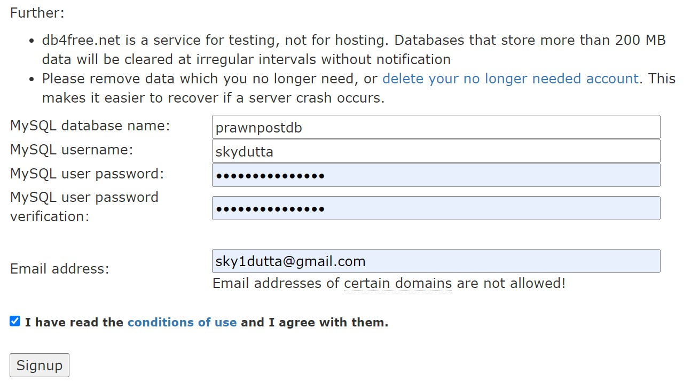
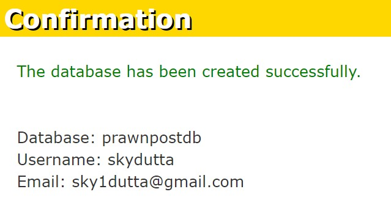

# PrawnPost CLI -> Twitter Like Text Based Social Platform (No GUI, Only CLI)

`Test Database (MySQL)` -> [db4free.net](https://www.db4free.net/phpmyadmin)  
`pip install mysql-connector-python`  
`pip install python-dotenv`  
`pip install uuid`  
  
`db4free.NET Password Saved in Google Password Manager`  
  

